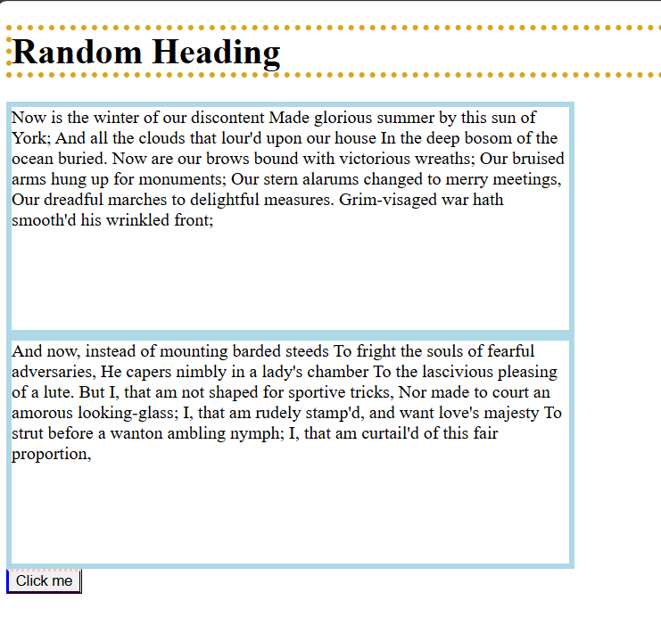

# CSS-Box-Model
A focused practice repository to understand and implement the CSS Box Model with clean examples.
## In this repo I am using multiple CSS files for implementing Box Model

# Box Model include
1.Height
2.Width
3.Border
4.Marginn
5.Padding

Output 

## Border
